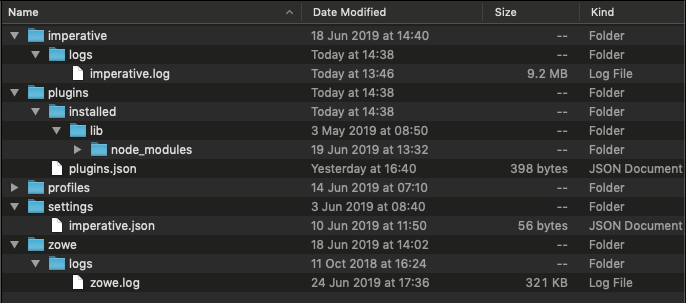

# Gathering information to troubleshoot Zowe CLI

Follow these instructions to gather specific pieces of information to help troubleshoot CLI issues.

## Identify the currently installed CLI version

Issue the following command:

```
zowe -V 
``` 

Zowe CLI versions may vary depending upon if the stable or incremental edition was used.  

For the forward-development version:

```
npm list -g @zowe/cli
```

For the 

```
npm list -g @brightside/core@lts-incremental
```

More information regarding versioning conventions for Zowe CLI and Plug-ins is located in [Versioning Guidelines](https://github.com/zowe/zowe-cli/blob/master/docs/MaintainerVersioning.md) 

## Identify the currently installed versions of plug-ins

Issue the following command:
```
zowe plugins list
```
The output describes version and the registry information. Note that the offical downloads are located at https://api.bintray.com/npm

## Environment variables

The following settings are configurable via environment variables: 

### Log levels

Environment variables are available to specify logging level and the CLI home directory
**Important\!** Setting the log level to TRACE or ALL might result in "sensitive" data being logged. For example, command line arguments will be logged when TRACE is set.

| Environment Variable | Description | Values | Default |
| ---------------------- | ----------- |------- | ------- |
| `ZOWE_APP_LOG_LEVEL`        | Zowe CLI logging level            | Log4JS log levels (OFF, TRACE, DEBUG, INFO, WARN, ERROR, FATAL) | DEBUG   |
| `ZOWE_IMPERATIVE_LOG_LEVEL` | Imperative CLI Framework logging level | Log4JS log levels (OFF, TRACE, DEBUG, INFO, WARN, ERROR, FATAL) | DEBUG   |

### Home directory

You can set the location on your computer where Zowe CLI creates the *.zowe* directory, which contains log files, profiles, and plug-ins for the product:

| Environment Variable | Description | Values | Default |
| ---------------------- | ----------- | ------ | ------- |
| `ZOWE_CLI_HOME`  | Zowe CLI home directory location | Any valid path on your computer | Your computer default home directory |

The values for these can be **echo**ed

## Home directory structure



### Location of logs

There are two sets of logs to be aware of the imperative log which generally contains installation and configuration information and the zowe log which contains information about interaction between CLI and the server endpoints. These should be analyzed for relevant information reagrding what has caused an issue.

### Profile configuration

The `profiles` folder stores connnection information. 

**Important\!** The profile directory may contain "sensitive" information, such as the users mainframe password. Users should obfuscate aby sensitive references before providing configuration files.

## Node.js and npm
Zowe CLI should be compatible with Node.js v8 and greater. 

To gather Node.js and npm versions, use the following:
```
node --version
npm --version
```

### npm configuration 
If the user is having trouble installing Zowe CLI from an npm registry, gathering their npm configuration will help identify issues with registry settings, global install paths, proxy settings, etc.
```
npm config ls -l
```
### npm log files
In case of errors, npm will create log files in `npm_cache\_logs` location. To get the `npm_cache` location for specific OS you can run:
```
npm config get cache
```
By default npm keeps only 10 log files, but sometimes more are needed. You can instruct the user to increase the log count by doing:
```
npm config set logs-max 50
```
- this command will increase the log count to 50, so that more log files will be kept on the system. Now the user can run tests multiple times and will not loose the log files. They can later be passed to Support for analysis. 

As the log files are created only when an npm conmmand fails, but you are interested to see what is executed, you can increase the loglevel of npm by doing:
```
npm config set loglevel verbose
```
- this way, you can see on the stdout all actions taken by npm. (if command is successful, it still does not generate a log file)
- log levels to choose from:   
"silent", "error", "warn", "notice", "http", "timing", "info", "verbose", "silly", with "notice" as the default one. 
- alternatively, you can pass `--loglevel verbose` on the command line, but this only works with npm related commands. By setting this in the config, it also works when you issue some `zowe` commands that use npm.(for ex. `zowe plugins install @zowe/cics`)
