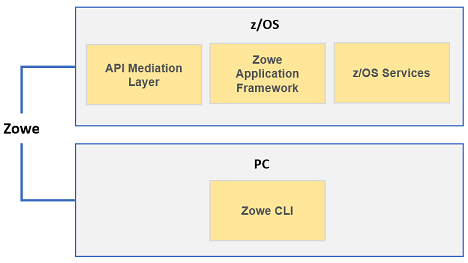

# Installing Zowe

Zowe consists of four main components: the Zowe Application Framework (zLUX), z/OS Services, API Mediation Layer, and Zowe CLI. You install the Zowe Application Framework, z/OS Services, and API Mediation Layer on z/OS and install Zowe CLI on your computer. The installations on z/OS and on a computer are independent processes.

## Installation roadmap

Installing Zowe involves several steps that you must complete in the appropriate sequence. Review the following installation roadmap that presents the task-flow for preparing your environment and installing and configuring Zowe before you begin the installation process.

| Tasks | Description
| --- | ---
| 1. Prepare your environment to meet the installation requirements. | See [System requirements](systemrequirements.md).
| 2. Allocate enough space for the installation. |  The installation process requires approximately 1 GB of available space. Once installed on z/OS, API Mediation Layer requires approximately 150MB of space, and the Zowe Application Framework requires approximately 50 MB of space before configuration. Zowe CLI requires approximately 200 MB of space on your computer.
| 3. Install components of Zowe. | To install Zowe runtime on z/OS, see [Installing the Zowe runtime on z/OS](install-zos.md). To install Zowe CLI on a computer, see [Installing Zowe CLI](cli-installcli.md).
| 4. Verify that Zowe is installed correctly. | To verify that the Zowe runtime is installed correctly, see [Verifying installation](install-zos.html#verifying-installation). To verify that Zowe CLI is installed correctly, see [Testing connection to z/OSMF](cli-installcli.html#testing-zowe-cli-connection-to-zosmf).
| 5. Optional: Troubleshoot problems that occurred during installation. | See [Troubleshooting the installation](../troubleshoot/troubleshootinstall.md).

To uninstall Zowe, see [Uninstalling Zowe](uninstall.md).